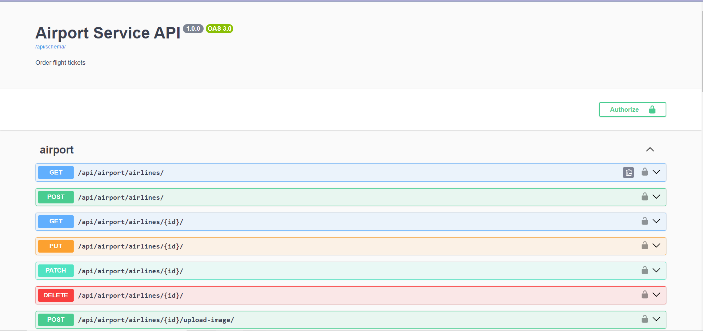

# Airport API Service


Is a RESTful API designed to manage data related to airports, flights, airplanes, and crew. It provides an easy way to interact with information about airports, schedule flights, register airplanes, and manage crew details.
### Database Schema


## Project Description

The **Airport API Service** aims to provide a robust backend system for aviation-related operations. It allows users to interact with various aspects of airport and flight management, including:

- **Airport Management**: Add, update, view, and delete airport information.
- **Flight Scheduling**: Create, update, and view flight schedules.
- **Airplane Management**: Register and update airplane details, including maintenance records.
- **Crew Management**: Add and manage crew members, including their certifications and shifts.

## Technologies Used

- **Django**: A high-level Python web framework for rapid development.
- **Django REST Framework**: A toolkit for building Web APIs.
- **PostgreSQL**: A powerful, open-source relational database system.
- **Docker**: Containerization platform for deployment and scalability.
- **JWT**: JSON Web Tokens for secure user authentication.

## Installation and Setup
1. Clone the repository:
    ```bash
    git clone https://github.com/OLENA-KALITSINSKA/airport-api-service.git
    cd airport-api-service
    ```
2. Set up a virtual environment:
    ```bash
    python -m venv venv
    # On Windows
    venv\Scripts\activate
    # On macOS
    source venv/bin/activate
    ```
3. Install dependencies:
    ```bash
    pip install -r requirements.txt
    ```
4. Run migrations:
    ```bash
    python manage.py migrate
    ```
5. Start the development server:
    ```bash
    python manage.py runserver
    ```

### Docker
For containerization, ensure you have Docker installed. You can use Docker to run the application in an isolated environment.

1. **Clone the Repository**:
    ```bash
    git clone https://github.com/OLENA-KALITSINSKA/airport-api-service.git
    cd airport-api-service
    ```

#### Building and Running the Docker Container

1. **Build the Docker Images**:
    ```bash
    docker-compose build
    ```

2. **Start the Containers**:
    ```bash
    docker-compose up
    ```

   This command will start both the Django application and the PostgreSQL database.

3. **Create a Superuser** (if needed):
   Open a new terminal window and run:
    ```bash
    docker-compose exec web python manage.py createsuperuser
    ```

4. **Access the Application**:
   Open your browser and go to `http://127.0.0.1:8000` to see the application running.

#### Stopping the Containers

To stop the containers, run:
```bash
docker-compose down
```

## API Documentation
- **Swagger**: [http://127.0.0.1:8000/api/doc/swagger/](http://127.0.0.1:8000/api/doc/swagger/)
- **ReDoc**: [http://127.0.0.1:8000/api/doc/redoc/](http://127.0.0.1:8000/api/doc/redoc/)

## Authentication

The API uses JWT (JSON Web Tokens) for authentication. Obtain a token by posting login credentials to:

- **get token**: http://127.0.0.1:8000/api/user/token/
- **refresh token**: http://127.0.0.1:8000/api/user/token/refresh/
- **verify token**: http://127.0.0.1:8000/api/user/token/verify/
- **create user**: http://127.0.0.1:8000/api/user/register/

Include the token in the `Authorization` header for subsequent requests using the `Bearer` scheme. For example:

`Authorization: Bearer <your_token>`

## API Resources

### 1. **Airports**
- **GET /api/airport/airports/**: List all airports.
- **POST /api/airport/airports/**: Create a new airport (admin only).

### 2. **Ticket Classes**
- **GET /api/airport/ticket_classes/**: List all ticket classes.
- **POST /api/airport/ticket_classes/**: Add a new ticket class (admin only).

### 3. **Routes**
- **GET /api/airport/routes/**: List all routes.
- **POST /api/airport/routes/**: Create a new route (admin only).

### 4. **Airplane Types**
- **GET /api/airport/airplane_types/**: List all airplane types.
- **POST /api/airport/airplane_types/**: Add a new airplane type (admin only).
- **GET /api/airport/airplane_types/{id}/**: Retrieve details of an airplane type.
- **PUT /api/airport/airplane_types/{id}/**: Update an airplane type.
- **DELETE /api/airport/airplane_types/{id}/**: Delete an airplane type.

### 5. **Airlines**
- **GET /api/airport/airlines/**: List all airlines.
- **POST /api/airport/airlines/**: Add a new airline (admin only).
- **GET /api/airport/airlines/{id}/**: Retrieve details of an airline.
- **PUT /api/airport/airlines/{id}/**: Update an airline.
- **DELETE /api/airport/airlines/{id}/**: Delete an airline.
- **POST /api/airport/airlines/{id}/upload-image/**: Upload an image for an airline (admin only).

### 6. **Airplanes**
- **GET /api/airport/airplanes/**: List all airplanes with filters by name or type.
- **POST /api/airport/airplanes/**: Add a new airplane (admin only).
- **GET /api/airport/airplanes/{id}/**: Retrieve details of an airplane.
- **PUT /api/airport/airplanes/{id}/**: Update an airplane.
- **DELETE /api/airport/airplanes/{id}/**: Delete an airplane.

### 7. **Crew**
- **GET /api/airport/crews/**: List all crew members.
- **POST /api/airport/crews/**: Add a new crew member (admin only).

### 8. **Flights**
- **GET /api/airport/flights/**: List all flights with filters by date, airplane, or route.
- **POST /api/airport/flights/**: Add a new flight (admin only).
- **GET /api/airport/flights/{id}/**: Retrieve details of a flight.
- **PUT /api/airport/flights/{id}/**: Update a flight.
- **DELETE /api/airport/flights/{id}/**: Delete a flight.

### 9. **Orders**
- **GET /api/airport/orders/**: Retrieve a list of user orders.
- **POST /api/airport/orders/**: Create a new order for a user.

## Screenshots

### API Interface Screenshots

Example of the API user interface.


Swagger


ReDoc

### Additional Information

- **Testing**: To run tests, use `python manage.py test`.